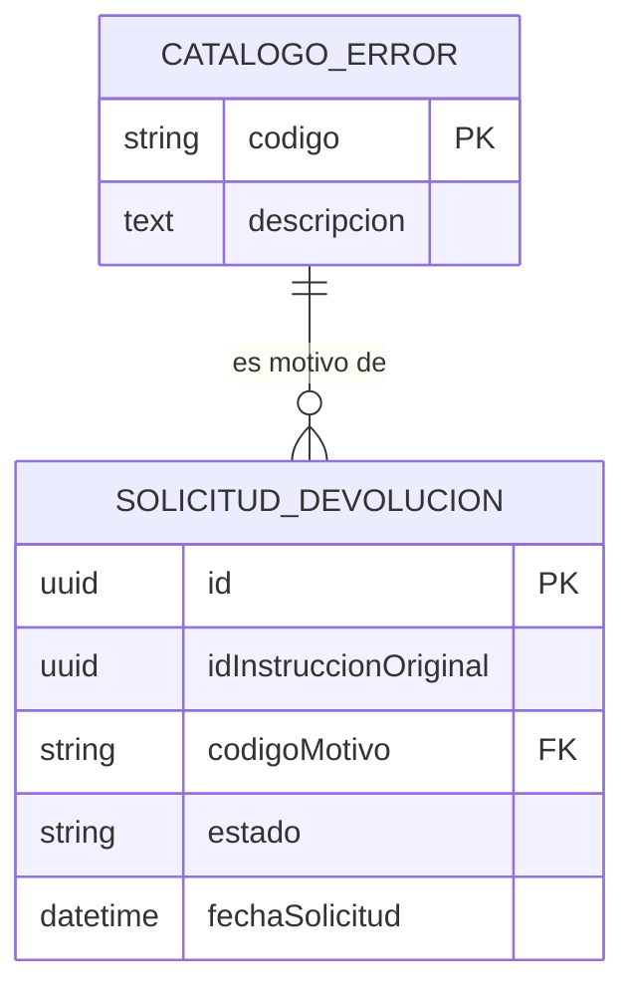

# MSCompensacionSwitch - Microservicio de Devoluciones (Returns)

🔄 Microservicio de Devoluciones (Returns)  
Este microservicio gestiona los reversos y devoluciones dentro del Switch Transaccional `NexusBank/Hermes`. Mantiene el catálogo de errores estándar (ISO 20022) y el ciclo de vida de una solicitud de devolución.

## 📋 Responsabilidades
- Catálogo de Errores: Mantener los códigos de motivo estandarizados (ej. `AC01`, `AM04`).
- Gestión de Solicitudes: Registrar y consultar devoluciones vinculadas a una instrucción original.
- Estados: Controlar si una devolución está `RECEIVED`, `REVERSED` o `FAILED`.

## 🛠 Tech Stack
- Java 21 (Eclipse Temurin)  
- Spring Boot 3.5.9  
- PostgreSQL 15 (Base de datos dedicada: `devolucion`)  
- Docker & Docker Compose

## ⚙️ Configuración de Puertos
| Servicio      | Puerto Interno (Container) | Puerto Externo (Host) | Descripción |
|---------------|----------------------------:|----------------------:|------------:|
| API           | 8085                       | 8085                  | API REST    |
| Base de Datos | 5432                       | 5437                  | PostgreSQL  |

## 🚀 Despliegue con Docker
Asegúrate de estar en la raíz del directorio del microservicio.

```bash
# 1. Construir la imagen y levantar los servicios
docker-compose up --build -d

# 2. Ver logs para confirmar inicio exitoso
docker-compose logs -f api
```

Nota: La primera vez que inicies, asegura que la variable `SPRING_JPA_HIBERNATE_DDL_AUTO` en `docker-compose.yml` esté en `update` para que se creen las tablas automáticamente.

## 🔗 Endpoints Principales

1. Catálogo de Errores (Motivos)  
Gestión de los códigos ISO que justifican la devolución.

- Crear Motivo: `POST /api/v1/reference/iso20022/errors`
```json
{
  "codigo": "AC03",
  "descripcion": "Account Number Invalid"
}
```

- Listar Motivos: `GET /api/v1/reference/iso20022/errors`

2. Solicitudes de Devolución  
Registro operativo de la devolución.

- Registrar Devolución: `POST /api/v1/transactions/returns`
```json
{
  "id": "a0eebc99-9c0b-4ef8-bb6d-6bb9bd380a11",
  "idInstruccionOriginal": "550e8400-e29b-41d4-a716-446655440000",
  "codigoMotivo": "AC03",
  "estado": "RECEIVED"
}
```

- Consultar por ID Original: `GET /api/v1/transactions/returns?idInstruccionOriginal={uuid}`
- Actualizar Estado: `PATCH /api/v1/transactions/returns/{id}/status?estado=REVERSED`

## 🧪 Pruebas Rápidas (cURL)

1. Poblar un error en el catálogo (requisito previo):
```bash
curl -X POST http://localhost:8085/api/v1/reference/iso20022/errors \
  -H "Content-Type: application/json" \
  -d '{"codigo": "AM05", "descripcion": "Duplication"}'
```

2. Crear una devolución:
```bash
curl -X POST http://localhost:8085/api/v1/transactions/returns \
  -H "Content-Type: application/json" \
  -d '{
    "id": "c56a4180-65aa-42ec-a945-5fd21dec0538",
    "idInstruccionOriginal": "b1234567-89ab-cdef-0123-456789abcdef",
    "codigoMotivo": "AM05",
    "estado": "RECEIVED"
  }'
```

## 🗄️ Modelo de Datos (Esquema Simplificado)


## Notas finales
- Proyecto con Maven, Spring Boot y PostgreSQL.
- Ajusta las variables de configuración en `application.yml` / `application.properties` y en `docker-compose.yml` según el entorno.
